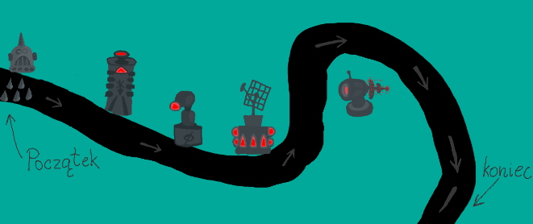
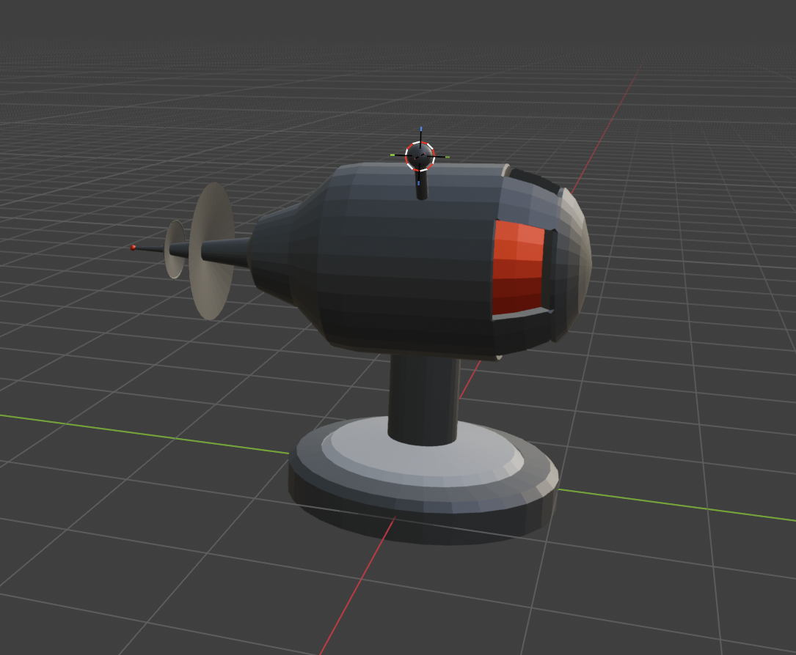
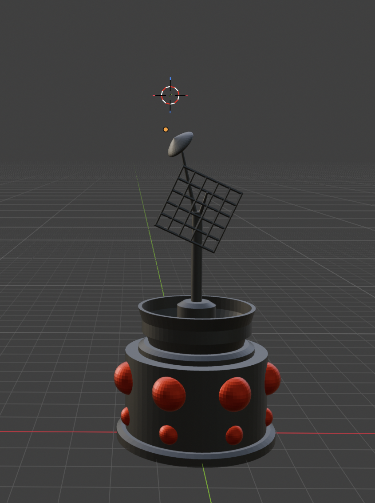
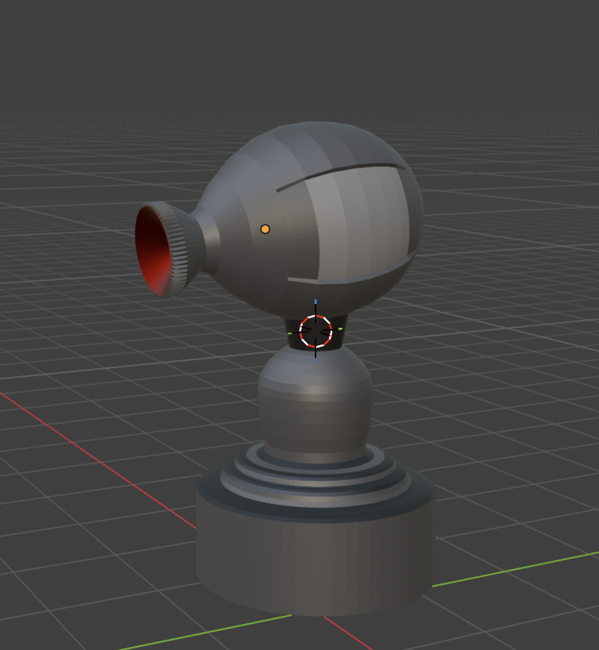
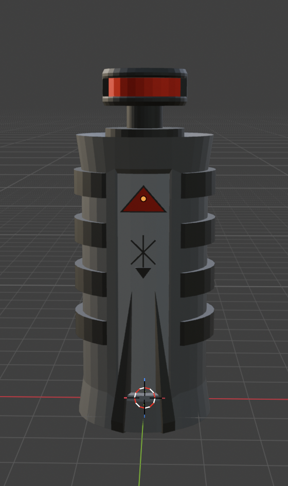
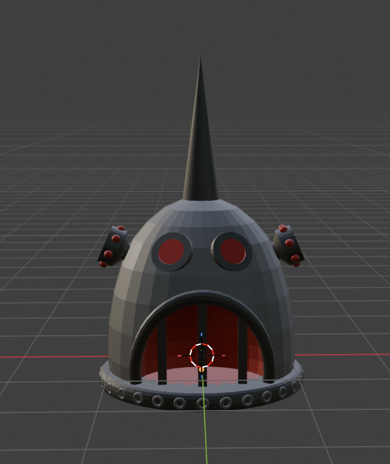

# 🗼 Wieże obronne – Modele 3D do gry tower defense

Modele 3D wież obronnych wykonane w **Blenderze** na podstawie  szkiców koncepcyjnych, przeznaczone do gry typu tower defense.

## Podgląd koncepcji

*Projekt widoku rozgrywki: kręta ścieżka, rozmieszczone wieże obronne.*

---

## Modele

### Wieża 1 – Gotycka

Masywna, bryła z ostrymi zakończeniami. 
Plik: `w1.blend`

---

### Wieża 2 – Industrialna

Smukła wieża z centralnym czerwonym elementem sygnalizacyjnym.
Plik: `w2.blend`

---

### Wieża 3 – Radarowa

Wieża z obrotową anteną / talerzem radarowym. 
Plik: `w3.blend`

---

### Wieża 4 – Wielolufowa

Kompaktowa jednostka z widocznymi lufami i czerwonymi elementami. 
Plik: `w4.blend`

---

### Wieża 5 – Mechaniczna

Model czaszkowy
Plik: `w5.blend`

---

## Opis modeli

Każda wieża została zaprojektowana jako unikalna jednostka o odmiennej stylistyce i funkcji w kontekście rozgrywki. Modele bazują na odręcznych szkicach koncepcyjnych i zostały odwzorowane w 3D w Blenderze.

---

## Workflow

1. **Szkic koncepcyjny** – odręczny rysunek każdej wieży z charakterystycznymi detalami
2. **Modelowanie w Blenderze** – budowa siatki low/mid-poly na podstawie szkicu
3. **Dopracowanie detali** – dodanie charakterystycznych elementów (lufy, anteny, świecące akcenty)
4. **Zapis** – eksport sceny jako plik `.blend`

---

## Kontekst gry

Wieże są elementem gry **tower defense**, w której:
- Wróg porusza się po **krętej ścieżce** od punktu *Początek* do *Koniec*
- Wieże rozmieszczone są wzdłuż trasy i atakują gracza
-

---

## Narzędzia

- **Modelowanie**: Blender 
- **Format roboczy**: `.blend`
